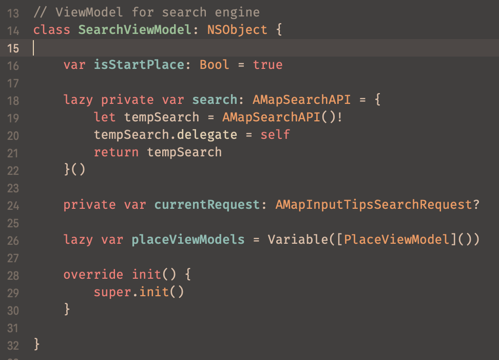

# Gruvbox Material Theme for Xcode

A Xcode color theme based on [Gruvbox Material](https://github.com/sainnhe/gruvbox-material)

## Installation

1. Clone this repo from Github.
2. Create and open folder `~/Library/Developer/Xcode/UserData/FontAndColorThemes/`
3. Copy and paste the `Gruvbox\ Material.xccolortheme` file into the folder
4. Open `Xcode > Preferences`
5. Choose `Gruvbox Material` under `Fonts & Colors` to apply it.

## Preview

***PS**: Font used in the preview: Fira Code Regular Nerd Font*
